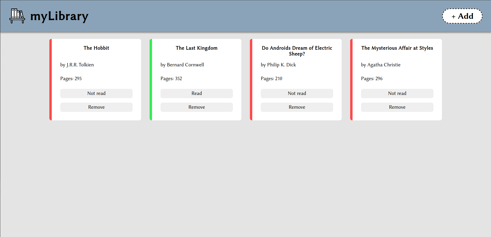
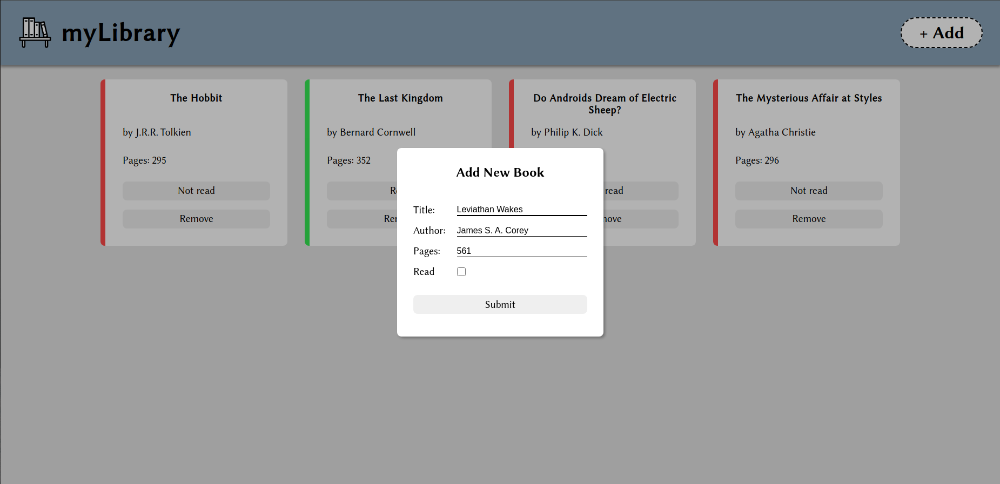

# Library

This is small Library app created as part of The Odin Project curriculum.

### <a href="https://dimitrije108.github.io/library/">LIVE VERSION</a>

## What I learned

* Using Objects and Object Constructors for the first time
* A bit about the Object Prototype and Prototypal inheritance
* Manipulating DOM elements and associating them with corresponding objects
* Iterating through objects in an array
* Creating and styling modals

